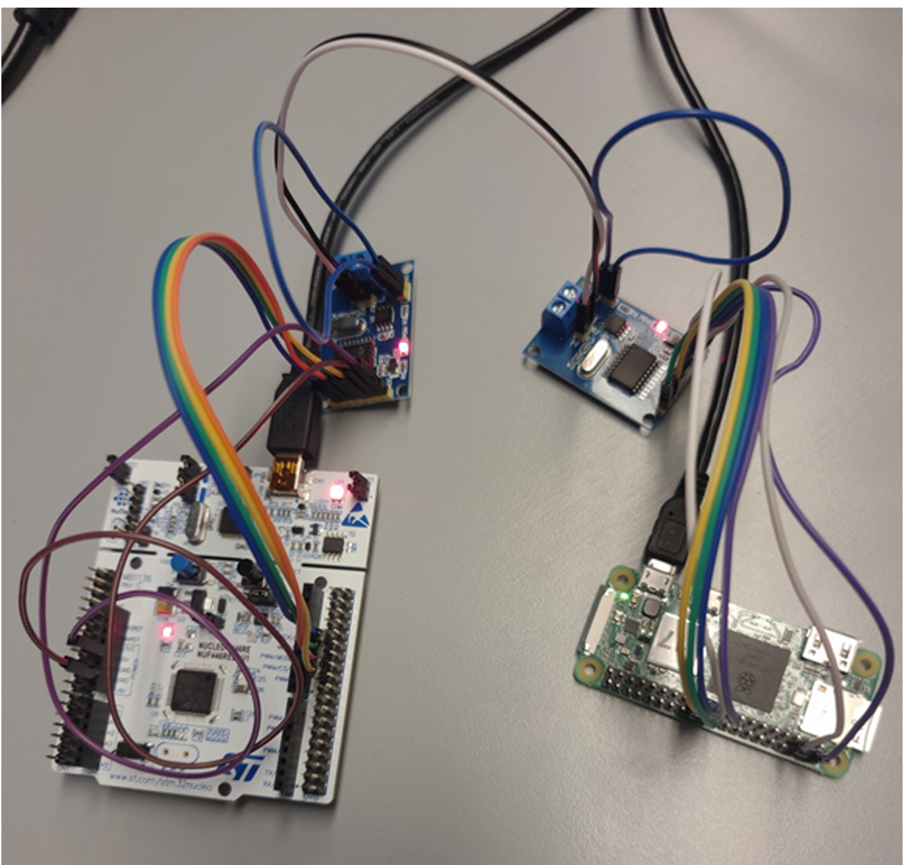
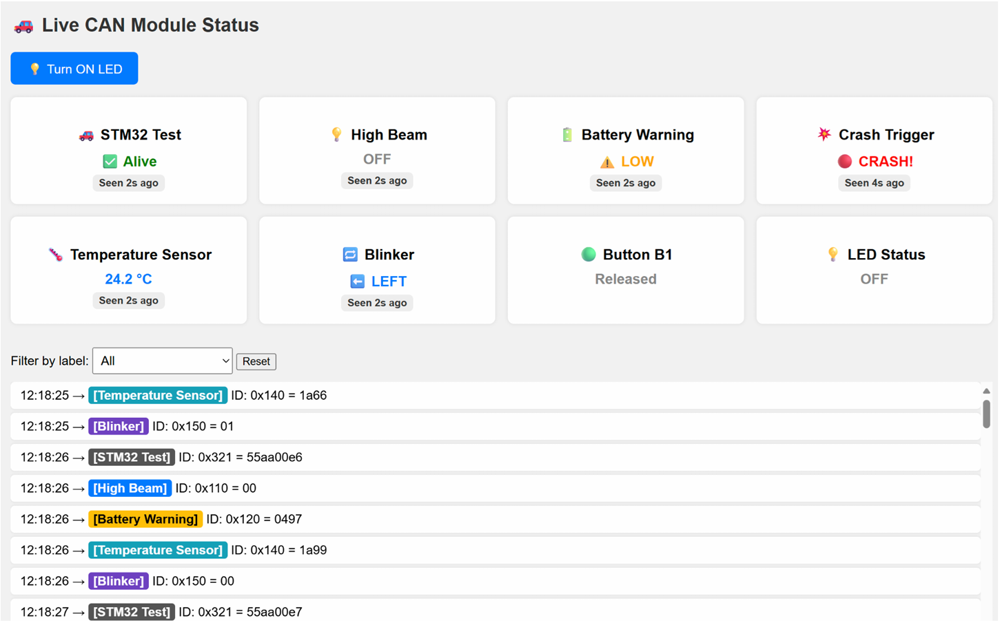

# canbus_project

**[📄 Project Report: CAN Traffic Simulator and Driver Information Module (DIM)](docs/CAN%20Traffic%20Simulator%20and%20Driver%20Information%20Module%20(DIM)%20Project.pdf)**

A demo project for CAN bus communication between an STM32 Nucleo board (with MCP2515 CAN controller) and a Raspberry Pi dashboard.

---

## Project Images

**Hardware setup:**  


**Web dashboard:**  


---

## Overview

- **STM32 Firmware** ([stm32/](stm32/)): Sends and receives CAN messages using an MCP2515 over SPI. Periodically transmits test, status, and sensor messages, and responds to control messages (e.g., LED toggle).
- **Raspberry Pi Dashboard** ([pi_can_dashboard/](pi_can_dashboard/)): Flask web app that monitors CAN traffic, displays live status, and allows remote control (e.g., toggling an LED on the STM32) via a web interface.

## Features

- Periodic CAN messages: test, high beam, battery voltage, crash trigger, temperature, blinker, button state.
- CAN receive buffer with interrupt and polling support.
- UART logging for debugging.
- Web dashboard with live status tiles, message log, and LED control.
- CAN message logging to CSV.
- **Interrupt-driven CAN RX**: Uses EXTI3 (PB3) for MCP2515 INT pin, with fallback polling.
- Modular STM32 firmware: `main.c`, `utils.c`, `can_buffer.c`, `interrupts.c`, etc.

## Directory Structure

```
stm32/
  ├── src/           # STM32 firmware source code
  │   ├── main.c             # Main application loop and CAN message logic
  │   ├── utils.c/h          # Utility functions for CAN, UART, and test message helpers
  │   ├── can_buffer.c/h     # Ring buffer for received CAN frames
  │   ├── interrupts.c/h     # EXTI interrupt setup and handler for MCP2515 INT pin (PB3)
  │   ├── spi.c              # SPI1 peripheral and MCP2515 CS pin initialization
  │   ├── uart.c/h, uart_log.h # UART2 initialization and logging/print helpers
  │   ├── clock.c            # System clock configuration (84 MHz, HSI+PLL)
  │   ├── gpio.c             # GPIO initialization (LED, button, INT pin)
  │   └── stm32f4xx_it.c/h   # Core interrupt handlers (SysTick, EXTI3)
  ├── lib/           # MCP2515 driver (low-level SPI routines for CAN controller)
  ├── include/       # Project-wide header files
  ├── test/          # PlatformIO unit tests for STM32 code
  └── platformio.ini # PlatformIO build configuration

pi_can_dashboard/
  ├── app.py         # Flask web app: CAN interface, live dashboard, and control endpoints
  └── templates/
      └── index.html # HTML template for the dashboard UI

docs/
  ├── CAN Traffic Simulator and Driver Information Module (DIM) Project.pdf # Project report
  ├── Hardware.png      # Photo of hardware setup
  └── webinterface.png  # Screenshot of web dashboard

README.md
```

### Module Explanations

- **main.c**: Main application loop, CAN message logic, and periodic message sending.
- **utils.c/h**: Helper functions for CAN, UART, and test message generation.
- **can_buffer.c/h**: Implements a ring buffer for received CAN frames.
- **interrupts.c/h**: Sets up and handles EXTI interrupts for the MCP2515 INT pin (PB3).
- **spi.c**: Initializes SPI1 peripheral and configures MCP2515 chip select (CS) pin.
- **uart.c/h, uart_log.h**: UART2 initialization and logging/print helpers for debugging.
- **clock.c**: System clock configuration (HSI + PLL, 84 MHz).
- **gpio.c**: GPIO initialization for LED, user button, and INT pin.
- **stm32f4xx_it.c/h**: Core interrupt handlers (SysTick, EXTI3).
- **lib/**: Contains the MCP2515 CAN controller driver (low-level SPI routines).
- **include/**: Project-wide header files.
- **test/**: PlatformIO unit tests for STM32 code.
- **platformio.ini**: PlatformIO build configuration.
- **pi_can_dashboard/app.py**: Flask web app for CAN monitoring and control.
- **pi_can_dashboard/templates/index.html**: Web dashboard UI template.
- **docs/**: Documentation, project report, and images.

## Getting Started

### STM32 Firmware

1. **Hardware**: Nucleo-F446RE + MCP2515 CAN module.
2. **Build & Upload**:
   - Install [PlatformIO](https://platformio.org/).
   - Connect your board via ST-Link.
   - In the `stm32/` directory, run:
     ```sh
     pio run --target upload
     ```
3. **Serial Monitor**:
   - To view UART logs:
     ```sh
     pio device monitor
     ```
4. **CAN Interrupt Setup**:
   - MCP2515 INT pin must be connected to PB3 (EXTI3) on the Nucleo.
   - The firmware supports both interrupt and polling for CAN RX.

### Raspberry Pi Dashboard

1. **Hardware**: Raspberry Pi with CAN interface (e.g., PiCAN2 or MCP2515 HAT).
2. **Setup CAN**:
   - Enable SPI and CAN overlays.
   - Bring up CAN interface:
     ```sh
     sudo ip link set can0 up type can bitrate 500000
     ```
3. **Install dependencies**:
   ```sh
   cd pi_can_dashboard
   pip install flask python-can
   ```
4. **Run the dashboard**:
   ```sh
   python app.py
   ```
   - Open [http://localhost:5000](http://localhost:5000) in your browser.

## CAN Message Map

| ID     | Label             | Description                |
|--------|-------------------|----------------------------|
| 0x321  | STM32 Test        | Heartbeat/test message     |
| 0x110  | High Beam         | High beam status           |
| 0x120  | Battery Warning   | Battery voltage            |
| 0x130  | Crash Trigger     | Crash event                |
| 0x140  | Temperature Sensor| Temperature reading        |
| 0x150  | Blinker           | Blinker status             |
| 0x160  | Button B1         | User button state          |
| 0x170  | LED Control       | Toggle LED (from Pi)       |
| 0x171  | LED Status        | LED state (from STM32)     |

## License

MIT License

---

For details, see [stm32/](stm32/) and [pi_can_dashboard/](pi_can_dashboard/).
